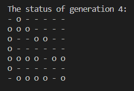

[](https://classroom.github.com/open-in-codespaces?assignment_repo_id=10165801)

PHAS0100ASSIGNMENT1
------------------


Purpose
-------

This project serves as a starting point for the PHAS0100 2022/23 Assignment 1 Game of Life Simulation coursework. It has a reasonable folder structure for [CMake](https://cmake.org/) based projects that use [CTest](https://cmake.org/) to run unit tests via [Catch](https://github.com/catchorg/Catch2). 

Further information on the specific project is left as an exercise for the student.


Credits
-------

This project is maintained by [Dr. Jamie Quinn](http://jamiejquinn.com/). It is based on [CMakeCatch2](https://github.com/UCL/CMakeCatch2.git) that was originally developed as a teaching aid for UCL's ["Research Computing with C++"](https://github-pages.ucl.ac.uk/research-computing-with-cpp/) course developed by [Dr. James Hetherington](http://www.ucl.ac.uk/research-it-services/people/james) and [Dr. Matt Clarkson](https://iris.ucl.ac.uk/iris/browse/profile?upi=MJCLA42).


Build Instructions
------------------

To run cmake:

```
cmake -B build
```

To compile:

```
cmake --build build
```

To test:

```
cd build
ctest
```

A example of the result of ctest:


## Game of Life Simulator

### Instructions

After build, user can use command line to access the game of life simulator (./build/bin/gof_simulator). User can get useful help message when run with no arguments or run with --help or -h options:

```
./build/bin/gof_simulator -h
```


User can run the program by specify a valid file path, or grid size (number of row and column) and alive cell number. However, please notice that user should input two integers when use -s to specify the size of grid, for example:

```
./build/bin/gof_simulator -s 5 5
```

Any invalid arguments will cause errors:


An example of specify a file path, and set maximum generation as 1:


Finally, user can interrupt running programs by using "CTRL + C".


### Running with glider.txt
To use glider.txt initialize grid (with generation 4):
```
./build/bin/gof_simulator -f test/data/glider.txt -g 4
```
After 4 evolutions, the result of grid that initialized by glider.txt is shown as below:


The whole process is shown as below:


### 7 x 7 random grid
To use 7 by 7 randomly initialized grid (with generation 4 and 15 alive cells initially):
```
./build/bin/gof_simulator -s 7 7 -n 15 -g 4
```
After 4 evolutions, the result of 7 by 7 randomly initialized grid is shown as below:



The whole process is shown as below:


## Finding stationary patterns

### Instructions

After build, user can use command line to access the app of finding stationary patterns (./build/bin/still_lifes). User can get useful help message when run with no arguments or run with --help or -h options:

```
./build/bin/still_lifes
```


User can run the program by specify the grid size, alive cell number, maximum iteration number, and initial condition number. Same as before, please input two integers when use -s to specify the size of grid. Moreover, the row and column must larger or equal to 4 in this application, otherwise a error will be reported.


An example of specify a 4 x 4 grid, and set maximum iteration as 5, number of live cells is 6, and initial condition number is 20:


### Find still lifes

To run the program for a 4 by 4 grid of cells (with 5 alive cells, maximum iteration 5, and 10 initial conditions):

```
./build/bin/still_lifes -s 4 4 -i 5 -n 5 -c 10
```

As a result, we found 3 still lifes,  the screenshots are shown as below:


## Usage

Additionally, user can explore more functionality of the game of life. Users are allow to add their code into the file of "src/game.cpp", and run it after building by using command:

```
./build/bin/game
```

